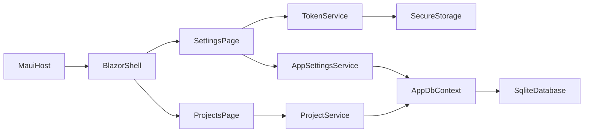

# Phase 1 and 2 Execution Plan

## Objective
Finish the Foundation + Project Setup (Phase 1) and Storage/Settings/Project Management (Phase 2) in a single execution pass, ending with a runnable app that supports secure global settings and project CRUD.

## Current Baseline
- Solution structure exists: `DevStudioApp` + `DevStudioDomain`.
- MAUI Blazor host and basic scaffold pages are present.
- Domain currently has `Project` and `WorkItem`, but Phase 2 requires additional app-level settings and service wiring.
- Existing job/service files are mostly commented and are out of scope for Phase 1/2 completion.

## Scope and Deliverables

### Phase 1 Deliverables (Foundation)
- Confirm and finalize MAUI Blazor shell layout with:
  - left navigation drawer
  - top app bar
  - routed main content area
- Ensure MudBlazor is correctly initialized and used in layout components.
- Add structured logging baseline (Serilog) and startup wiring.
- Theme support baseline (light/dark toggle persisted via settings service contract).

### Phase 2 Deliverables (Storage + Settings + Projects)
- Database and domain:
  - Add `AppSettings` entity (singleton-style record).
  - Ensure `Project` aligns with required fields (`Name`, `LocalRepoPath`, `RemoteAzureRepoUrl`, timestamps).
  - Add EF Core migration(s) and DB initialization flow.
- Secure tokens:
  - Introduce `ITokenService` abstraction backed by `SecureStorage` for `CopilotToken` and `AzurePat`.
- Settings experience (`/settings`):
  - masked token inputs
  - test actions for Copilot CLI and Azure connectivity
  - general preferences (theme, default worktree path, logging level)
- Project management (`/projects`):
  - grid/list view
  - create/edit/delete project dialogs/forms
  - validation for local path and Azure repo URL format
- Navigation integration:
  - Projects in left drawer
  - project switcher state in app shell
  - Settings entry in top app bar
- First-run flow:
  - if no project/tokens exist, force onboarding steps before normal usage.

## Implementation Workstreams

### 1) Shell and UI Foundation
- Target files:
  - [c:/Repos/DevStudio/DevStudioApp/DevStudioApp/Components/Layout/MainLayout.razor](c:/Repos/DevStudio/DevStudioApp/DevStudioApp/Components/Layout/MainLayout.razor)
  - [c:/Repos/DevStudio/DevStudioApp/DevStudioApp/Components/Layout/NavMenu.razor](c:/Repos/DevStudio/DevStudioApp/DevStudioApp/Components/Layout/NavMenu.razor)
  - [c:/Repos/DevStudio/DevStudioApp/DevStudioApp/Components/Routes.razor](c:/Repos/DevStudio/DevStudioApp/DevStudioApp/Components/Routes.razor)
- Build shell scaffold and route placeholders for `/projects` and `/settings`.

### 2) Domain + Persistence
- Target files:
  - [c:/Repos/DevStudio/DevStudioApp/DevStudioDomain/Entities/Project.cs](c:/Repos/DevStudio/DevStudioApp/DevStudioDomain/Entities/Project.cs)
  - [c:/Repos/DevStudio/DevStudioApp/DevStudioDomain/AppDbContext.cs](c:/Repos/DevStudio/DevStudioApp/DevStudioDomain/AppDbContext.cs)
  - new `AppSettings.cs` in `DevStudioDomain/Entities`
- Add/update entity mappings, indexes, and defaults.
- Add migration and startup DB initialization.

### 3) Services (Settings, Tokens, Project CRUD)
- Add application services in `DevStudioApp` for:
  - token storage and retrieval
  - app settings management
  - project CRUD + active project selection
- Register services in [c:/Repos/DevStudio/DevStudioApp/DevStudioApp/MauiProgram.cs](c:/Repos/DevStudio/DevStudioApp/DevStudioApp/MauiProgram.cs).

### 4) Settings and Projects Pages
- Create/expand routed Razor pages under `Components/Pages` for:
  - `Settings`
  - `Projects`
- Build MudBlazor forms/grids/dialogs and wire to services.

### 5) Onboarding Guard
- Add startup guard that redirects to setup experience when prerequisites are missing:
  - missing tokens
  - no projects configured

### 6) Logging and Diagnostics
- Add Serilog packages and configure startup logging pipeline.
- Capture key user actions (save settings, token test, project create/edit/delete).

## Proposed Architecture (Phase 1/2)

## Validation and Exit Criteria
- App launches with shell layout and working navigation.
- `/settings` persists preferences and securely stores tokens.
- `/projects` supports full CRUD and active project selection.
- First-run onboarding is enforced when required data is missing.
- Database schema is created/migrated automatically on first launch.
- Logging is visible for core workflows.

## Risks and Mitigation
- SecureStorage behavior differences on Windows:
  - mitigate with clear error handling + fallback messaging.
- Folder picker integration complexity:
  - mitigate by implementing typed abstraction with platform-specific code behind service boundary.
- Existing copied/commented legacy classes causing confusion:
  - keep Phase 1/2 implementation isolated; defer cleanup to later refactor task.
