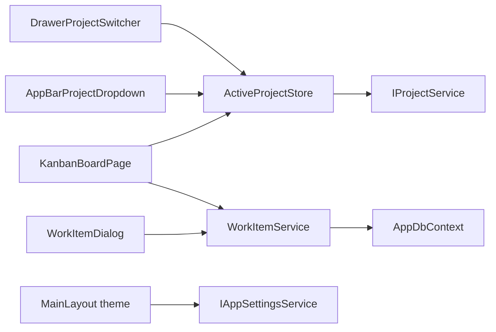

# Phase 3 Execution Plan (Kanban + Phase 1/2 gap fixes)

This document tracks the **executed** Phase 3 plan: persistent per-project Kanban, folded Phase 1/2 navigation/picker/theme gaps, and follow-up items. It is the durable record for this execution pass (like [Phase1-2-Execution-Plan.md](./Phase1-2-Execution-Plan.md) for earlier work).

## Objective

Deliver the milestone **persistent per-project Kanban fully functional** while closing gaps that were specified in [HighLevelPlan.md](./HighLevelPlan.md) but not yet implemented in the app: drawer project switcher, app bar project dropdown, folder picker for local repo path, theme persistence via `AppSettings`, and app-wide active project state.

## Decisions (locked for this execution)

- **Kanban lanes:** `backlog`, `planned`, `in-progress`, `review`, `done`. Legacy six-state agent values are remapped in the database migration.
- **Gaps:** Navigation, picker, theme, and active project are implemented in the same pass as the board (not deferred).

## Implementation status

| Area | Status | Notes |
|------|--------|--------|
| A1 `ActiveProjectStore` (singleton, `IServiceScopeFactory` for `IProjectService`) | Done | `Services/ActiveProjectStore.cs`; `InitializeAsync` after migrate in `MauiProgram.cs` |
| A2 Drawer project list + New Project | Done | `Components/Layout/NavMenu.razor` |
| A3 App bar `MudMenu` project switcher | Done | `Components/Layout/MainLayout.razor` |
| A4 Folder picker for `LocalRepoPath` | Done | `IFolderPickerService` + `FolderPickerService` using **CommunityToolkit.Maui** `FolderPicker` (not `Microsoft.Maui.Storage`); Browse on `Projects.razor` |
| A5 Theme persistence | Done | `MainLayout` loads/saves `AppSettings.Theme` via `IAppSettingsService` |
| B1 `WorkItem` + `KanbanStatuses` | Done | `DevStudioDomain/Entities/WorkItem.cs`, `DevStudioDomain/KanbanStatuses.cs`, index on `(ProjectId, Status, Order)` in `AppDbContext` |
| B2 EF migration `Phase3Kanban` | Done | `DevStudioDomain/Migrations/*Phase3Kanban*` with `Order` column, status backfill SQL, composite index |
| B3 `IWorkItemService` / `WorkItemService` | Done | `Services/WorkItemService.cs`, scoped registration |
| B4 `/board` page | Done | `Components/Pages/Board.razor` — search, debounce, `MudDropContainer` / `MudDropZone` |
| B5 Work item dialog | Done | `Components/Dialogs/WorkItemDialog.razor` — title, description, optional fields; **description is `MudTextField` pending MudEx** (see follow-up) |
| B6 Nav + setup guard + Home CTA | Done | Board link, `board` in allowed routes, Home CTA when active project exists |
| B7 `AddMudExtensions()` | Done | `MauiProgram.cs` |
| Build / validation | Done | `dotnet build` clean; manual board + theme left to you on device |

**Follow-up tracking (not blocking the above):** [Phase3-FollowUp-Todos.md](./Phase3-FollowUp-Todos.md) (MudEx markdown editor bind, optional multi-platform folder picker notes).

## Scope and deliverables (summary)

### Workstream A — Phase 1/2 gap fixes

- In-memory observable **active project** store; drawer and app bar stay in sync with `IProjectService` + preferences.
- **NavMenu:** project list, active indication, navigate to `/board` on select; **New Project** → `/projects`.
- **MainLayout:** project **MudMenu**; **theme** read on init and written on toggle.
- **Projects:** **Browse** invokes folder picker; saving/deleting projects refreshes the active project store where applicable.
- **CommunityToolkit.Maui** added for folder picking; `UseMauiCommunityToolkit()` in the MAUI builder.

### Workstream B — Phase 3 Kanban core

- **Domain:** five lanes, `Order` per lane, `KanbanStatuses` labels and list.
- **Migration:** add `Order`, remap legacy statuses, order backfill per lane, replace `IX_WorkItems_ProjectId` with composite index.
- **Service:** list (search), create (backlog tail), update, delete (repack order), move (cross-lane and same-lane reorder).
- **UI:** `/board` with five columns, card click → dialog, new task, structured logging for moves/CRUD.
- **Dialog:** `IMudDialogInstance` (MudBlazor 8); create/update/delete wired to the service.

## Proposed architecture (Phase 3)

## Key files (reference)

| Kind | Path |
|------|------|
| Store | `DevStudioApp/Services/ActiveProjectStore.cs` |
| Picker | `DevStudioApp/Services/FolderPickerService.cs` |
| Work items | `DevStudioApp/Services/WorkItemService.cs` |
| Host / DI | `DevStudioApp/MauiProgram.cs` |
| Layout | `DevStudioApp/Components/Layout/MainLayout.razor`, `NavMenu.razor` |
| Pages | `DevStudioApp/Components/Pages/Projects.razor`, `Board.razor`, `Home.razor` |
| Dialog | `DevStudioApp/Components/Dialogs/WorkItemDialog.razor` |
| Domain | `DevStudioDomain/Entities/WorkItem.cs`, `DevStudioDomain/KanbanStatuses.cs`, `AppDbContext.cs` |
| Migrations | `DevStudioDomain/Migrations/` (includes `Phase3Kanban`) |

## Validation and exit criteria (from plan)

- [x] Migrations apply on startup; existing `WorkItem` rows get remapped statuses and lane ordering.
- [x] Drawer and app bar reflect active project; switching updates everywhere.
- [x] Theme persists across restarts (via `AppSettings.Theme`).
- [x] `/projects` Browse uses native folder picker (Community Toolkit) on supported platforms.
- [x] `/board` shows five lanes; drag/drop and search scoped to the active project; logging on CRUD/move.
- [ ] Optional: [Phase3-FollowUp-Todos.md](./Phase3-FollowUp-Todos.md) — MudEx markdown description control when bind is finalized.

## Risks and mitigations (as executed)

- **MudEx markdown API:** description uses `MudTextField` until MudEx two-way bind is aligned with the shipped package; tracked in the follow-up doc.
- **Folder API:** `Microsoft.Maui.Storage.FolderPicker` is not in-box; **CommunityToolkit.Maui** supplies `FolderPicker` and is referenced explicitly.
- **MudBlazor 8 dialogs:** `IMudDialogInstance` replaces `MudDialogInstance`.
- **MudBlazor 8 drag/drop:** `MudDropContainer` / `MudDropZone` / `MudItemDropInfo` on `/board` — verify on target OS after deploy.

---

*This file should be updated when follow-up items in [Phase3-FollowUp-Todos.md](./Phase3-FollowUp-Todos.md) are completed (e.g. check off the optional validation line and note the final MudEx component name).*
