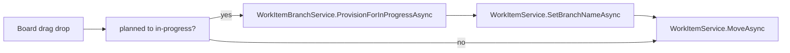

# Phase 4 Execution Plan (Git Integration Happy Path)

This document tracks the Phase 4 execution pass for Git integration in Dev Agent Studio. The scope is intentionally happy-path: branch, commit, and push flows are implemented with clear preflight feedback and no destructive operations.

## Objective

Deliver safe Git automation for day-to-day task delivery: branch provisioning on `planned` -> `in-progress`, plus commit and push actions from work item context.

## Sub-plans

- [Phase4-SubPlan-Branch-On-InProgress.md](./Phase4-SubPlan-Branch-On-InProgress.md)

## Decisions (locked for this execution)

- Trigger: `planned` -> `in-progress` transition on board drag/drop.
- Branch naming: `feature/{itemId}-{slugTitle}`.
- Base: current checked-out branch (`HEAD`) in the active project repository.
- Collision behavior: if local/remote branch exists, increment suffix (`-2`, `-3`, ...).
- Persistence: save resulting branch to `WorkItem.BranchName`.
- Commit flow: stage all, commit with task-oriented message, fail fast when no changes.
- Push flow: push current task branch to `origin` with PAT-backed HTTP header.
- Safety: no destructive branch operations in this phase.

## Implementation status

| Area | Status | Notes |
|------|--------|-------|
| P1 Branch provisioning service | Done | `Services/WorkItemBranchService.cs` with git CLI commands, slug generation, suffixing, and checkout |
| P2 Work item branch persistence API | Done | `SetBranchNameAsync` in `Services/WorkItemService.cs` |
| P3 Board transition integration | Done | `Components/Pages/Board.razor` detects `planned` -> `in-progress`, provisions branch, stores `BranchName`, then moves card |
| P4 DI registration | Done | `Extensions/ServiceCollectionExtensions.cs` registers `IWorkItemBranchService` |
| P5 Commit/push service | Done | `Services/WorkItemGitService.cs` with preflight checks, commit, push, and PAT auth header |
| P6 Task UI actions | Done | `Components/Dialogs/WorkItemDialog.razor` includes Commit + Push actions with user feedback |
| P7 Execution documentation | Done | This file + linked sub-plan |

## Flow summary

## Validation checklist

- [x] Moving a task from `planned` to `in-progress` with no branch creates a new branch.
- [x] Branch name follows `feature/{id}-{slug}` and suffixes on collision.
- [x] `WorkItem.BranchName` is saved and visible in board card chips.
- [x] Commit action stages and commits changes on the task branch (or reports no changes).
- [x] Push action pushes task branch to `origin` using global Azure PAT.
- [x] Build passes after integration changes.
- [ ] Validate against private Azure remote with PAT in a live repo session.
- [ ] Add dedicated unit tests around git command wrappers if test project is introduced.

## Risks and mitigations

- Remote branch existence checks may fail without valid remote auth in local shell context.
  - Mitigation: service logs warning and still enforces local collision checks.
- Branch is created before status persistence, so a later move failure can leave a created branch.
  - Mitigation: non-destructive by design; user can retry move. Cleanup automation deferred to follow-up.
- Different git versions can vary on branch command behavior.
  - Mitigation: use broad-compatible `git checkout -b` for branch creation.

## Follow-up candidates

- Add branch reuse policy toggle for items that already have `BranchName`.
- Add cleanup command for abandoned task branches/worktrees.
- Add PR creation trigger after developer review/approval workflow is introduced.
